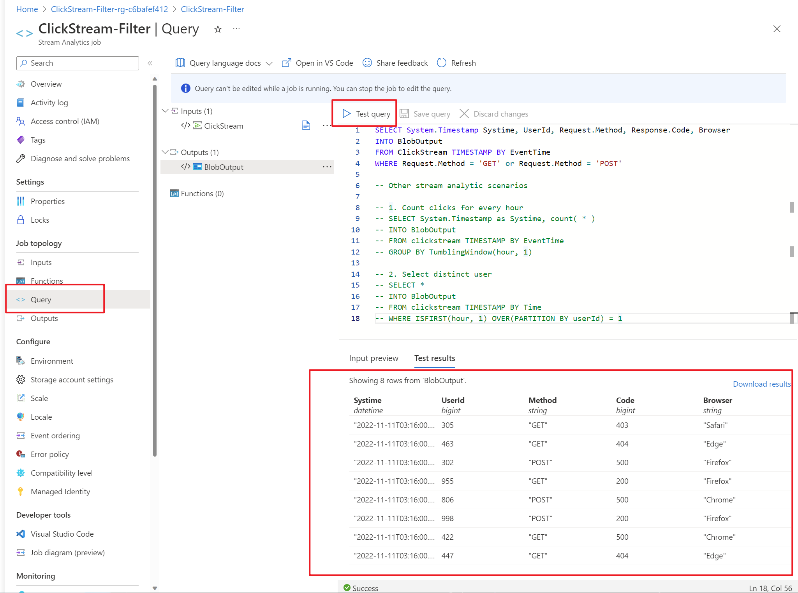
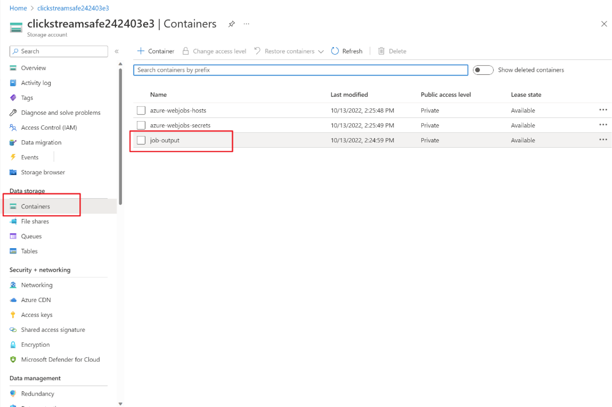

# Build a streaming application with data generator

This project contains application examples that show you how to implement streaming applications in Azure. You learn to deploy Azure resources using PowerShell and explore different stream processing scenarios with generated data stream. This is only for proof-of-concept (POC) or testing, not suitable for production scenarios.

For more information about Azure Stream Analytics, see [here](https://learn.microsoft.com/en-us/azure/stream-analytics/stream-analytics-introduction).

## Prerequisites

* Azure subscription. If you do not have one, create a [free account](https://azure.microsoft.com/en-us/free/)
* Azure PowerShell module. If you need to install or upgrade, see [Install Azure PowerShell module](https://learn.microsoft.com/en-us/powershell/azure/install-Az-ps).

## Application Examples

This repository has several application examples you can use to build your streaming application. Each example uses different Azure setups with mock data generated.

| **Application name** | **Goal** | **Concepts used** |
| ------------ | --------------------------------------------- | -------------------------------- |
| Clickstream-Filter | Extract GET and POST requests from clickstream | One stream input, filter operators            |
| Clickstream-RefJoin | Join userid with a user file | Join two inputs (clickstream and reference DB) |
| Twitter sentiment analysis (coming soon) | Real-time sentiment analysis of Twitter data | `LIKE`, Tumbling window |
| Geofencing (coming soon) | Build a geofencing for a manufacturing company to track if a device leaves a certain area. | `GeoJSON` object, geospatial aggregation |

### Clickstream-Filter

In this example, you learn to extract `GET` and `POST` requests from a website clickstream and store the output results to an Azure Blob Storage. Here's the architecture for this example:


Sample of clickstream data:

```json
{
    "EventTime": "2022-09-09 08:58:59 UTC",
    "UserID": 465,
    "IP": "145.140.61.170",
    "Request": {
    "Method": "GET",
    "URI": "/index.html",
    "Protocol": "HTTP/1.1"
    },
    "Response": {
    "Code": 200,
    "Bytes": 42682
    },
    "Browser": "Chrome"
}
```

Follow these steps to deploy resources:

1. Open PowerShell from the Start menu, clone this GitHub repository to your working directory.

    ```powershell
    git clone https://github.com/Azure/azure-stream-analytics.git
    ```

2. Go to **BuildApplications** folder.

    ```powershell
    cd .\azure-stream-analytics\BuildApplications\
    ```

3. Sign in to Azure and enter your Azure credentials in the pop-up browser.

    ```powershell
    Connect-AzAccount
    ```

4. Replace `$subscriptionId` with your Azure subscription id and run the following command to deploy Azure resources. This process may take a few minutes to complete.

    ```powershell
    .\CreateJob.ps1 -job ClickStream-Filter -eventsPerMinute 11 -subscriptionid $subscriptionId
    ```

    * `eventsPerMinute` is the input rate for generated data. In this case, the input source generates 11 events per minute.
    * You can find your subscription id in **Azure portal > Subscriptions**.

5. Once the deployment is completed, it opens your browser automatically, and you can see a resource group named **ClickStream-Filter-rg-\*** in the Azure portal. The resource group contains the following five resources:

    | Resource Type | Name | Description |
    | ------------ | --------------------------------------------- | -------------------------------- |
    | Azure Function | clickstream* | Generate clickstream data |
    | Event Hub | clickstream* | Ingest clickstream data for consuming |
    | Stream Analytics Job | ClickStream-Filter | Define a query to extract `GET` requests from the clickstream input |
    | Blob Storage | clickstream* | Output destination for the ASA job |
    | App Service Plan | clickstream* | A necessity for Azure Function |

6. The ASA job **ClickStream-Filter** uses the following query to join the clickstream with reference input. You can select **Test query** in the query editor to preview the output results.

    ```sql
    SELECT System.Timestamp Systime, UserId, Request.Method, Response.Code, Browser
    INTO BlobOutput
    FROM ClickStream TIMESTAMP BY Timestamp
    WHERE Request.Method = 'GET' or Request.Method = 'POST'
    ```

    

7. All output results are stored as `JSON` file in the Blog Storage. You can view the result via: Blob Storage > Containers > job-output.


8. **Congratulation!** You've deployed a streaming application to extract requests from a website clickstream. For other stream analytic scenarios with one stream input, you can check out the comments in the query and use them as examples for your own project. 
    * Count clicks for every hour

        ```sql
        select System.Timestamp as Systime, count( * )
        FROM clickstream
        TIMESTAMP BY EventTime
        GROUP BY TumblingWindow(hour, 1)
        ```

    * Select distinct user

        ```sql
        SELECT *
        FROM clickstream
        TIMESTAMP BY Time
        WHERE ISFIRST(hour, 1) OVER(PARTITION BY userId) = 1
        ```

## Clickstream-RefJoin

If you want to find out the username for the clickstream using a user file in storage, you can join the clickstream with a reference input as following architecture:


Assume you've completed the steps for previous example, run following commands to create a new resource group:

1. Replace `$subscriptionId` with your Azure subscription ID. This process may take a few minutes to deploy the resources:

    ```powershell
    .\CreateJob.ps1 -job ClickStream-RefJoin -eventsPerMinute 11 -subscriptionid $subscriptionId
    ```

2. Once it's done, it opens your browser automatically and you can see a resource group named **ClickStream-RefJoin-rg-\*** in the Azure portal.

3. The ASA job **ClickStream-RefJoin** uses the following query to join the clickstream with reference sql input.

    ```sql
    CREATE TABLE UserInfo(
      UserId bigint,
      UserName nvarchar(max),
      Gender nvarchar(max)
    );
    SELECT System.Timestamp Systime, ClickStream.UserId, ClickStream.Response.Code, UserInfo.UserName, UserInfo.Gender
    INTO BlobOutput
    FROM ClickStream TIMESTAMP BY EventTime
    LEFT JOIN UserInfo ON ClickStream.UserId = UserInfo.UserId
    ```

4. **Congratulation!** You've deployed a streaming application to find out the username of a website clickstream.

## Clean up resources

If you've tried out this project and no longer need the resource group, run this command on PowerShell to delete the resource group.

```powershell
Remove-AzResourceGroup -Name $resourceGroup
```

If you're planning to use this project in the future, you can skip deleting it, and stop the job for now.

## Need Help?

If you have issues with this project or questions about ASA, report an issue [here](https://github.com/Azure/azure-stream-analytics/issues).

For information about ASA, visit:
* [Quickstart: Create an Azure Stream Analytics job in VS Code](https://learn.microsoft.com/en-us/azure/stream-analytics/quick-create-visual-studio-code)
* [Test ASA queries locally against live stream input](https://learn.microsoft.com/en-us/azure/stream-analytics/visual-studio-code-local-run-live-input)
* [Optimize query using job diagram simulator](https://learn.microsoft.com/en-us/azure/stream-analytics/optimize-query-using-job-diagram-simulator)
